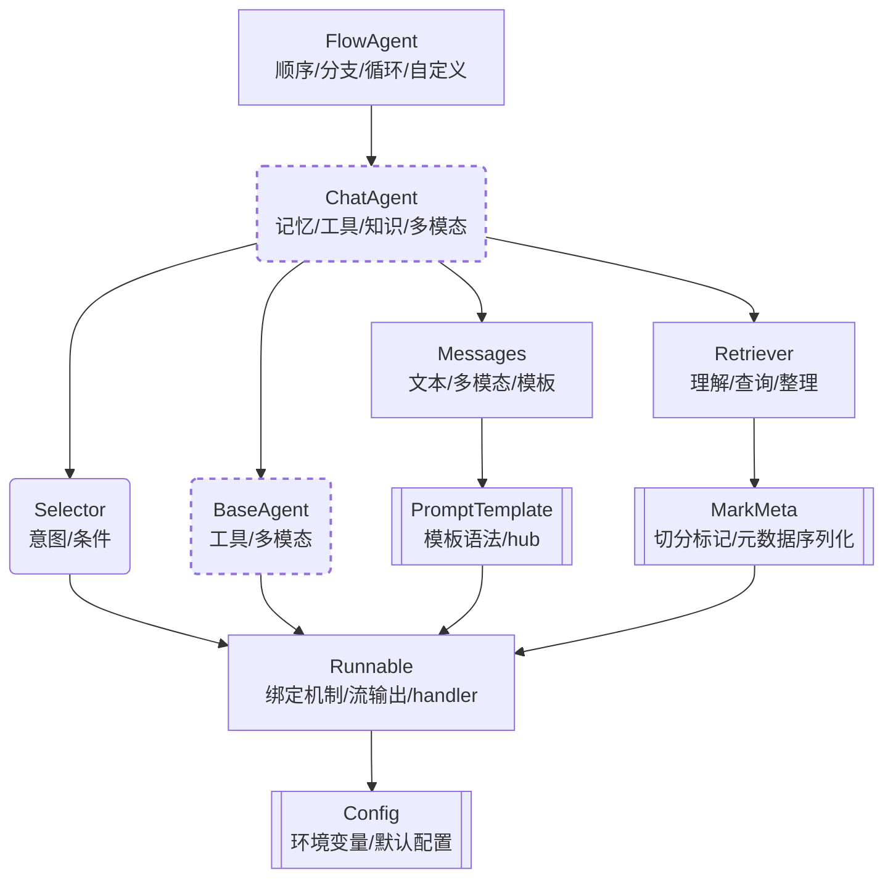

# ✨🦋 illufly

[](https://pypi.org/project/illufly/)

`illufly` 是 `illution butterfly` 的缩写，中文为"幻蝶"。

**illufly** 的目标是快速构建多智能体的对话和写作场景。

* [《illufly 快速指南》](https://github.com/arcstep/illufly/wiki/Home)

**入门指南**
* [安装配置指南](https://github.com/arcstep/illufly/wiki/安装指南)
* [模块导入参考](https://github.com/arcstep/illufly/wiki/模块参考)
* [开箱即用的流输出](https://github.com/arcstep/illufly/wiki/流输出)
* [大模型支持](https://github.com/arcstep/illufly/wiki/模型列表)
* [使用检索增强（RAG）](https://github.com/arcstep/illufly/wiki/RAG)

**实践案例**
* [连续对话案例](https://github.com/arcstep/illufly/wiki/对话)
* [长文写作案例](https://github.com/arcstep/illufly/wiki/长文写作)
* [多智能体协作案例](https://github.com/arcstep/illufly/wiki/多智能体)

**高级主题**
* [illufly 的设计理念](https://github.com/arcstep/illufly/wiki/设计理念)
* [illufly 的工作流设计](https://github.com/arcstep/illufly/wiki/工作流)
* [illufly 的推理模式实现](https://github.com/arcstep/illufly/wiki/推理模式)
* [自定义提示语模板](https://github.com/arcstep/illufly/wiki/提示语模板)
* [自定义大模型](https://github.com/arcstep/illufly/wiki/自定义大模型)


## 使用示例

**1. 基本能力**

illufly 最主要是封装了 ChatAgent 基类，在进一步实现千问、智谱以及 OpenAI 等大模型厂家的接口后，获得了 ChatQwen、ChatZhipu 以及 ChatOpenAI 等子类。

由于 ChatAgent 封装了多轮对话、工具回调、流输出等常用能力，ChatQwen 等子类可以直接使用这些能力。

```python
from illufly.chat import ChatQwen

chat = ChatQwen()
chat("你是什么模型？")
```

```
输出内容: (我是一个流式输出的动画)
```

**2. 工具回调**

ChatAgent 在使用工具回调时非常简洁，只需要将工具列表传递给类的实例即可，不需要多余的代码。

```python
from illufly.chat import ChatQwen

def tool1(input: str):
    """我是一个会写诗的工具"""
    return "大海啊, 全是水"

chat = ChatQwen(tools=[tool1])
chat("你是什么模型？")
```

**3. 复杂推理**

默认情况下，你只能使用 OpenAI 风格的工具回调。<br>
但你可能还想使用其他推理模式，illufly 中已经实现这些推理风格:

- ReAct 一边推理一边执行 (ReAct 论文)[https://arxiv.org/abs/2210.03629]
- ReWOO 一次性规划所有步骤后一起执行 (ReWOO 论文)[https://arxiv.org/abs/2305.18323]
- PlanAndSolve 一边修订总体计划一边执行 (Plan-and-Solve 论文)[https://arxiv.org/abs/2305.04091]

你也可以参考 illufly 的源码，实现自己的推理模式。

```python
from illufly.chat import ChatQwen, ReAct

def tool1(input: str):
    """我是一个会写诗的工具"""
    return "大海啊, 全是水"

chat = ReAct(
    planner=ChatQwen(tools=[tool1])
)
chat("你是什么模型？")
```

**3. 多智能体协作**

illufly 也允许你定义多个智能体，并让它们协作完成任务。

下面的 FlowAgent 代码实现了 **Reflection** 推理模式。
代码中定义了一个条件循环，写手和评分专家协作完成一首儿歌的创作和评分。

```python
from illufly.chat import FlowAgent, ChatQwen, Selector

writer = ChatQwen(
    name="写手",
    memory=("system", "你是一个写手")
)

evaluator = ChatQwen(
    name="评分专家",
    memory=("system", "你是一个评分专家，根据对方写的内容评价1分-5分，仅输出评价和最终结果")
)

def should_continue():
    return "__END__" if "5" in evaluator.last_output else "写手"

flow = FlowAgent(writer, evaluator, Selector(condition=should_continue))

flow("你能帮我写一首关于兔子的四句儿歌?")
```

## 知识塔

如果你想学习 illufly 的全部内容，下面是一个知识结构的指引。

该图不是模块的继承关系，而是知识主题的依赖关系。
也就是说，如果你要了解某个上层模块，就必须先了解下层模块。



## 安装指南

**安装 `illufly` 包**

```sh
pip install illufly
```

**推荐使用 `dotenv` 管理环境变量**

将`APIKEY`和项目配置保存到`.env`文件，再加载到进程的环境变量中，这是很好的实践策略。

```
## OpenAI 兼容的配置
OPENAI_API_KEY="你的API_KEY"
OPENAI_BASE_URL="你的BASE_URL"

## 阿里云的配置
DASHSCOPE_API_KEY="你的API_KEY"

## 智谱AI的配置
ZHIPUAI_API_KEY="你的API_KEY"
```

在 Python 代码中，使用以下代码片段来加载`.env`文件中的环境变量：

```python
from dotenv import load_dotenv, find_dotenv
load_dotenv(find_dotenv(), override=True)
```


