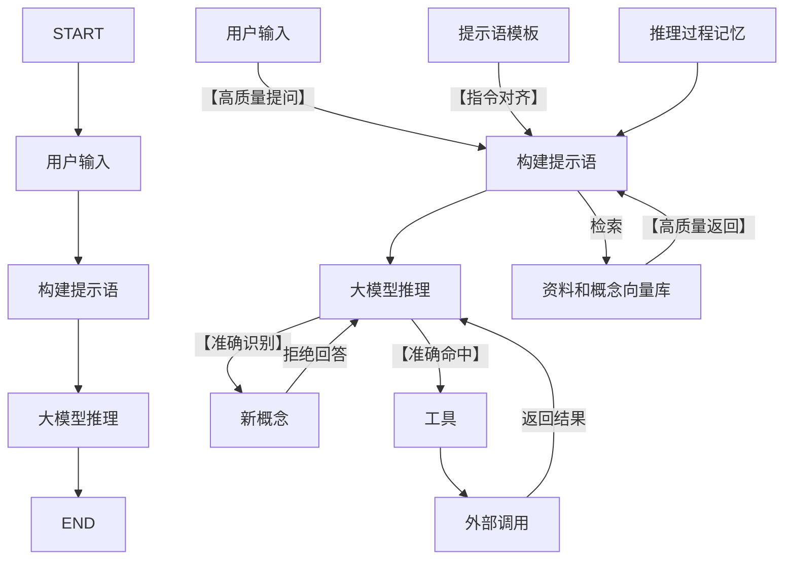

# 对话智能体规划

## 设计目标

- 生成结果对齐：根据提示语模板、知识、工具描述和对话历史，生成目标结果文本
- 知识和概念召回：根据用户问题匹配到知识库，召回知识和相关概念
- 工具命中：根据用户问题、知识库、概念解释选择工具，包括数据分析工具、信号控制工具、工单跟踪工具等
- 新概念发现：如果已有工具无法匹配到用户问题，或已有的问题涉及到未拆解的新概念，则将新概念加入到知识库，等待知识完善，并拒绝回答问题

## 智能体结构

## 工具构造

- 数据分析工具的入参和结果
- 信号控制工具的入参和结果
- 大屏操作指令的入参和结果
- 工单跟踪工具的入参和结果

## 效果评测和反向构造

1. 【提示语对齐】评测大模型的提示语对齐能力
    - 反向构造：根据知识片段（或相关概念），构造问题
    - 反向构造：根据工具调用结果，构造问题
2. 【知识召回】根据较好的提示语模板，评测各个RAG方案的知识召回能力
    - 反向构造：根据工具调用结果和知识片段（或相关概念），构造问题
3. 【工具命中】根据较好的提示语模板，评测各个大模型的工具命中能力
    - 反向构造：根据工具调用入参，构造问题
4. 【工具命中】根据选中的提示语模板和大模型，结合RAG评价工具命中能力
    - 反向构造：根据工具调用入参和知识片段（或相关概念），构造问题
5. 【新概念发现】根据选中的提示语模板和大模型，结合RAG评价新概念发现能力
    - 反向构造：根据工具调用入参和知识片段（或相关概念），构造问题
    - 反向构造：根据新概念和知识片段（或相关概念），构造问题

