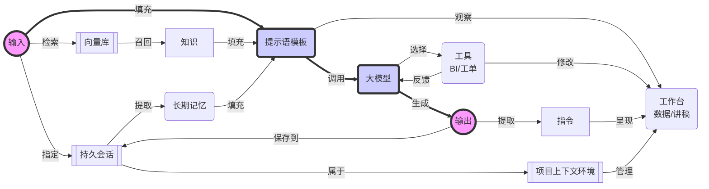
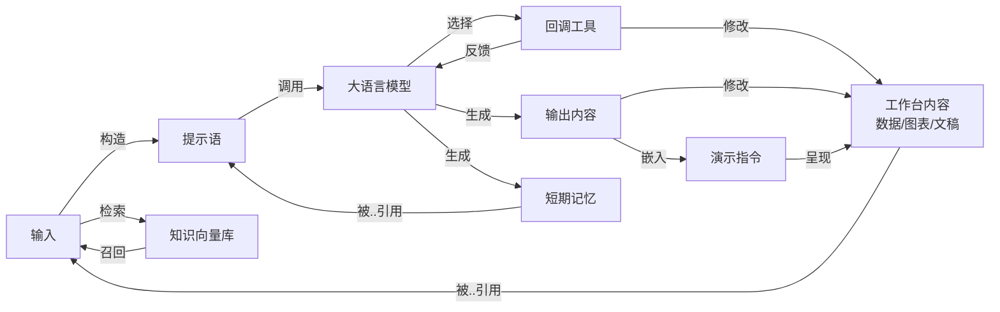
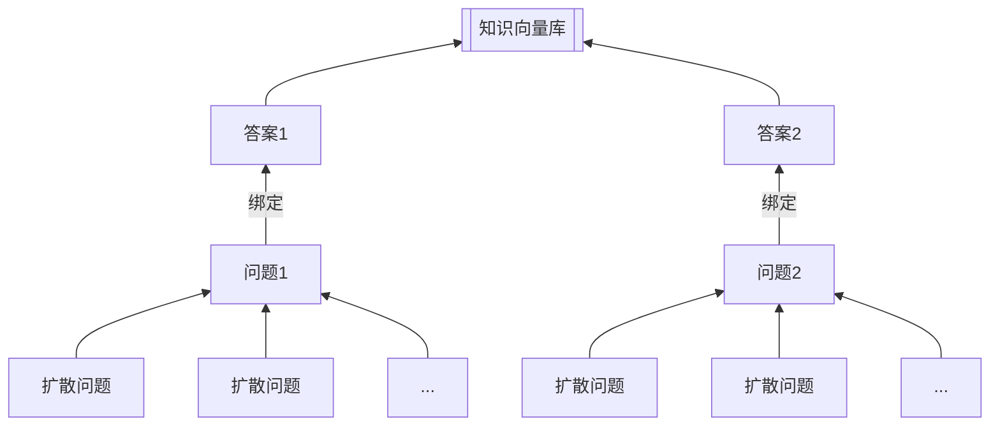

# illufly 模块规划

## （一）设计目标

**功能定位：**

以多智能体框架为基础，针对「对话」和「写作」两个核心场景，强化长文写作能力，强化数据分析能力，

**模块设计：**

- BaseTool
- ExecutorManager
- MemoryManager
- KnowledgeManager
- Runnable
- ChatAgent
    - LLM
    - Messages
- Team
    - Pipeline
    - Discuss
    - ToolsCalling
    - ReAct
    - Rewoo
    - Planner
    - SelfDiscover
    - SelfAsk
    - SelfFlextion
- Hub

**核心概念：**

- 智能体团队：指定多个智能体和协作规则，使其像单个智能体一样工作
- 智能体：对话和写作的上下文环境，包括大模型、提示语模板、推理引擎、知识加载、数据处理工具等
- 提示语：发送给大模型的消息列表，大模型推理主要通过提示语优化来实现
- 提示语模板：快速构建提示语，也可以通过映射规则来填充提示语模板变量，实现动态提示语
- 知识管理：提示语模板中可动态插入背景知识，如果背景知识太多则使用向量检索优化
- 工具：数据分析等工具是内置的，也可以支持自定义的工具
- 长时记忆：每个智能体、多智能体的历史对话结果都可以持久化保存
- 短时记忆：结合提示语模板的需要，从长时记忆、知识、数据、变量映射等进一步拼接
- 数据分析：数据分析是内置的，也是重点支持的工具
- API支持：全框架支持同步、异步、流式输出和SSE
- 评测支持：支持对话过程提取对大模型、提示语、工具、向量库的相关数据，生成评测基础

- 映射：实现数据的订阅机制，支撑多智能体协作
    - 支持从 Runnable 到 Runnable 的映射
    - 支持从 Runnable 到 Tool 的映射
    - 支持从 Runnable 到 Template 的映射
    - 支持从 Runnable 到 Team 的映射

**功能特性：**

1. 集成生产环境：支持流输出
    - [x] 日志打印：StreamLog流式打印
    - [x] 流式输出：支持模型调用、工具调用、知识检索、扩写调度等全方位流式输出
    - [ ] SSE格式输出：流式输出采用标准化SSE格式，方便前端集成
    - [ ] 异步支持：全框架支持异步，支持自动化异步包装器（例如自定义工具、自定义模型等）
    - [ ] 快速集成：FastAPI集成示范代码

2. 封装大模型：从原生API快速定义大模型
    - [x] 支持大模型自身的工具回调能力
    - [x] 支持openai通用推理模型
    - [x] 通义千问通用推理模型
    - [x] 智谱AI通用推理模型
    - [ ] 步支持多种大模型，如文心一言、讯飞星火、Kimi等
    - [ ] 支持模型混合调用策略
    - [ ] 增加模型Token管理能力
    - [ ] 增加模型费用管理：费率、费用、结算周期
    - [ ] 支持大模型能力评测：提取评测数据

3. 丰富推理模式：用多智能体架构封装推理策略
    - [ ] 内置支持自定义智能体：AgentAction、AgentFinish定义和解析
    - [ ] 内置支持 ReAct, ReWOO, Plan-and-Execute等
    - [ ] 内置支持 Self-Discover, Self-Flextion等

4. 支持知识管理：结合向量数据库
    - [x] 支持在提示语中嵌入知识背景，并去重
    - [ ] 支持从记忆中自动知识提取知识
    - [ ] 支持自动生成文本嵌入
    - [ ] 支持文本嵌入缓存
    - [ ] 支持更多缓冲存储方案：redis缓冲、mysql缓冲、mongodb缓冲等
    - [ ] 支持多种向量模型：openai、通义千问、智谱AI等
    - [ ] 支持多种文本嵌入数据库库：chroma、Faiss、milvus、lanceDB等
    - [ ] 支持对知识召回评估
    - [ ] 支持知识质量管理

5. 支持智能体持久化：可从历史状态恢复
    - [ ] 支持智能体数据持久化：将记忆、数据、知识、写作成果等保存到本地文件，并支持恢复
    - [ ] 支持多种持久化策略：sqlite、redis、mysql、mongodb等

6. 支持多种场景：
    - [x] 支持多轮对话
    - [x] 支持基于写作结果讨论
    - [x] 支持工具回调

8. 支持提示语模板：
    - [x] 支持提示语模板内置资源：创意、提纲、扩写
    - [ ] 支持提示语模板的本地模板
    - [ ] 支持提示语模板的服务端模板
    - [ ] 支持提示语模板的版本管理
    - [ ] 支持生成带有图片、表格、图表、流程图的模板

9. 支持数据分析：使用工具回调智能体
    - [ ] 工作台支持数据加载器：excel、csv、parquet
    - [ ] 工作台支持数据连接器： mysql、postgresql、sqlite、duckdb
    - [x] 工具支持 pandas 代码生成和执行
    - [ ] 工具支持 polar 代码生成和执行
    - [ ] 工具支持 mysql 代码生成和执行
    - [ ] 工具支持 duckdb 代码生成和执行

10. 封装更多工具：全面集成多模态能力
    - [ ] 支持探索式数据分析
    - [ ] 支持互联网搜索
    - [ ] 支持文生图模型
    - [ ] 支持文生视频模型
    - [ ] 支持图片理解模型
    - [ ] 支持视频理解模型

13. 导入文档：将文档转化为知识或向量库
    - [ ] 纯文本文档导入
    - [ ] markdown 文档导入
    - [ ] pdf 文档导入
    - [ ] 图片导入
    - [ ] 视频导入
    - [ ] 音频导入
    - [ ] html 文档导入
    - [ ] 网页链接导入
    - [ ] 网站爬取导入

14. 导出文档：分享对话内容和成果
    - [ ] 将工作台内容导出为 markdown 文档
    - [ ] 将多轮对话内容发布为共享网页
    - [ ] 将工作台内容发布为共享网页
    - [ ] 将工作台内容发布为摘要和对话主题

16. 支持安全风险防范管理
    - [ ] 自动审查知识库管理
    - [ ] 支持用户提问审查和据答机制：自动审查和抽查
    - [ ] 支持知识管理审查和禁用机制：自动审查和抽查
    - [ ] 支持工具管理审查和禁用机制：自动审查和抽查
    - [ ] 支持对生成结果审查和溯源机制：自动审查和抽查
    - [ ] 支持对严重违禁用户停服机制：黑名单管理

## （二）结构设计

在工作台智能体的设计要点中：
- 输入到输出的主流程是函数式调用（即幂等调用，调用多次无修改变量的副作用）
- 在长期记忆中保存多轮的文本对话历史
- 在工作台中保存等结构化数据、大文本文稿、流程图等需要在多轮对话中持续聚焦的状态
- 每个项目实例有一个工作台

## （三）工具构造

- 数据分析工具的入参和结果
- 信号控制工具的入参和结果
- 大屏操作指令的入参和结果
- 工单跟踪工具的入参和结果

## （四）效果评测和反向构造

- 【提示语对齐】评测大模型的提示语对齐能力
    - 反向构造：根据知识片段（或相关概念），构造问题
    - 反向构造：根据工具调用结果，构造问题
- 【知识召回】根据较好的提示语模板，评测各个RAG方案的知识召回能力
    - 反向构造：根据工具调用结果和知识片段（或相关概念），构造问题
- 【工具命中】根据较好的提示语模板，评测各个大模型的工具命中能力
    - 反向构造：根据工具调用入参，构造问题
- 【工具命中】根据选中的提示语模板和大模型，结合RAG评价工具命中能力
    - 反向构造：根据工具调用入参和知识片段（或相关概念），构造问题
- 【新概念发现】根据选中的提示语模板和大模型，结合RAG评价新概念发现能力
    - 反向构造：根据工具调用入参和知识片段（或相关概念），构造问题
    - 反向构造：根据新概念和知识片段（或相关概念），构造问题

# 二、对话工作台结构

## 1、工作台结构

### 场景1 流程展示
- 工作台内容即流程图定义的`mermaid`文本
- 演示指令就是流程图呈现，以及当前解说步骤的工作流节点
- 大模型输出时，同步输出数据、流程节点指示和流程说明的文本解说

### 场景2 数据分析
- 工作台内容即数据选择和`pandas`数据加载
- 演示指令就是数据呈现的图表，以及高亮、选择等操作
- 大模型输出时，同步输出数据、图表、演示操作和解说文本

## 2、知识召回优化

这主要适合如下场景：

- 知识库整体规模不大，但要求非常高的匹配度
- 适合结合人类参与、头脑风暴的方式构建问题库的初始问题清单
- 通过扩散模型扩散问题清单后，所形成的问题规模不大，可以通过向量数据库存储和检索

在初期使用时，可以使用通用模型结合`illufly`的响应提示语模板替代。

### 检索示例

在AI应用，使用`RAG`做检索时使用【扩散问题+答案】检索，并按照【答案】对结果去重。

- **构建**知识文档时，考虑【问题驱动】的方式构建知识结构。
- **存储**知识文档时，使用【扩散问答】的方法，扩大问题覆盖面，提高召回率。
- **检索**知识文档时，连同【问题+答案】一起检索，并按照【答案】合并相同结果。

## 3、提示语模板选择

## 4、回调工具

## 5、短期记忆优化

考虑写作场景，默认支持记忆过程中的【问答压缩】，避免单轮回答时生成长文过长占用历史。
具体压缩技巧包括：

- 针对提问的问题，保留前50个字和最后50个字，使其总数量不超过100个字
- 针对AI生成的回答，过滤掉 yaml 开头的部份，保留前50个字和最后50个字

## 6、嵌入演示指令

# 三、写作任务

## 1、结合提示语中的知识背景，编写扩写指南
若构建的知识库中包含代码示例、图表、表格等，应当追加其引用说明，并在生成提纲时提前从知识库中获得这些资料的背景知识。

- **图表：** 可使用`mermaid`语法绘制流程图、用例图、时序图、状态图、甘特图等。
- **表格：** 可使用`markdown`语法绘制表格。

>
- 在扩写指南中增加代码示例的描述
- 在扩写指南中增加图表的描述
- 在扩写指南中增加表格的描述

## 2、结合提示语中的知识背景，完成扩写

- 在扩写包含代码示例的段落时，应当优先考虑已有的代码示范
- 在扩写包含图表的段落时，应当优先参考已有的图表
- 在扩写包含表格数据的段落时，应当优先参考已有的表格

# 四、模型微调需求

## 1、数据分析大模型
按照数据分析习惯，生成数据分析的回调工具。
最好结合垂直行业情况来微调模型。

在初期使用时，可以使用通用模型结合`illufly`的响应提示语模板替代。

## 2、问答知识生成大模型
按照文档内容，以问题驱动的策略生成知识结构。
最好结合垂直行业情况，精心设计问题清单，以问题驱动的策略生成。

在初期使用时，可以使用通用模型结合`illufly`的响应提示语模板替代。

## 3、问答知识扩散大模型
从问题驱动的知识库中，将问题扩散数十倍、数百倍的问题数量。
这相当于构建【QA对】的缓冲机制。

这些问题必须适合使用文本向量比较的方法从问题中比对，以便通过RAG的方式完成知识召回。在具体的扩散策略中，应当结合垂直行业情况、数据分析等特点进行微调，以便按照特定的目标领域进行问题扩散。

## 4、内容演示大模型
按照内容特点和演示目的，生成演示讲解指令。

在初期使用时，可以使用通用模型结合`illufly`的响应提示语模板替代。
