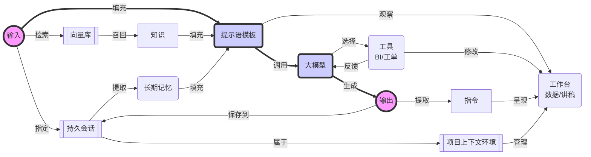
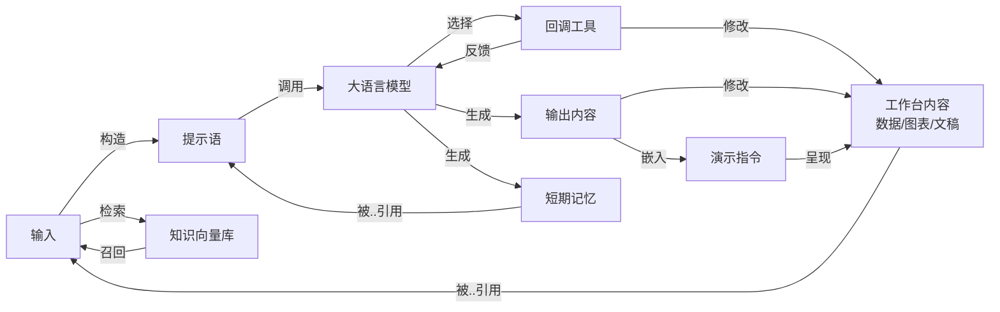
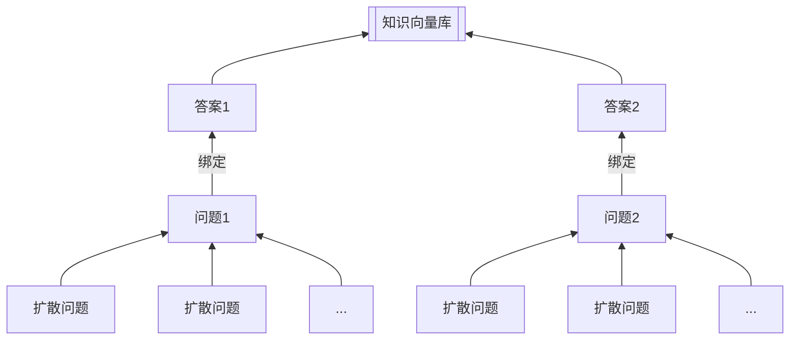

# 对话工作台智能体规划

## （一）设计目标

- 生成结果对齐：根据提示语模板、知识、工具描述和对话历史，生成目标结果文本
- 知识和概念召回：根据用户问题匹配到知识库，召回知识和相关概念
- 工具命中：根据用户问题、知识库、概念解释选择工具，包括数据分析工具、信号控制工具、工单跟踪工具等
- 新概念发现：如果已有工具无法匹配到用户问题，或已有的问题涉及到未拆解的新概念，则将新概念加入到知识库，等待知识完善，并拒绝回答问题

## （二）结构设计

在工作台智能体的设计要点中：
- 输入到输出的主流程是函数式调用（即幂等调用，调用多次无修改变量的副作用）
- 在长期记忆中保存多轮的文本对话历史
- 在工作台中保存等结构化数据、大文本文稿、流程图等需要在多轮对话中持续聚焦的状态
- 每个项目实例有一个工作台

## （三）工具构造

- 数据分析工具的入参和结果
- 信号控制工具的入参和结果
- 大屏操作指令的入参和结果
- 工单跟踪工具的入参和结果

## （四）效果评测和反向构造

- 【提示语对齐】评测大模型的提示语对齐能力
    - 反向构造：根据知识片段（或相关概念），构造问题
    - 反向构造：根据工具调用结果，构造问题
- 【知识召回】根据较好的提示语模板，评测各个RAG方案的知识召回能力
    - 反向构造：根据工具调用结果和知识片段（或相关概念），构造问题
- 【工具命中】根据较好的提示语模板，评测各个大模型的工具命中能力
    - 反向构造：根据工具调用入参，构造问题
- 【工具命中】根据选中的提示语模板和大模型，结合RAG评价工具命中能力
    - 反向构造：根据工具调用入参和知识片段（或相关概念），构造问题
- 【新概念发现】根据选中的提示语模板和大模型，结合RAG评价新概念发现能力
    - 反向构造：根据工具调用入参和知识片段（或相关概念），构造问题
    - 反向构造：根据新概念和知识片段（或相关概念），构造问题

# 二、对话工作台结构

## 1、工作台结构

### 场景1 流程展示
- 工作台内容即流程图定义的`mermaid`文本
- 演示指令就是流程图呈现，以及当前解说步骤的工作流节点
- 大模型输出时，同步输出数据、流程节点指示和流程说明的文本解说

### 场景2 数据分析
- 工作台内容即数据选择和`pandas`数据加载
- 演示指令就是数据呈现的图表，以及高亮、选择等操作
- 大模型输出时，同步输出数据、图表、演示操作和解说文本

## 2、知识召回优化

这主要适合如下场景：

- 知识库整体规模不大，但要求非常高的匹配度
- 适合结合人类参与、头脑风暴的方式构建问题库的初始问题清单
- 通过扩散模型扩散问题清单后，所形成的问题规模不大，可以通过向量数据库存储和检索

在初期使用时，可以使用通用模型结合`textlong`的响应提示语模板替代。

### 检索示例

在AI应用，使用`RAG`做检索时使用【扩散问题+答案】检索，并按照【答案】对结果去重。

- **构建**知识文档时，考虑【问题驱动】的方式构建知识结构。
- **存储**知识文档时，使用【扩散问答】的方法，扩大问题覆盖面，提高召回率。
- **检索**知识文档时，连同【问题+答案】一起检索，并按照【答案】合并相同结果。

## 3、提示语模板选择

## 4、回调工具

## 5、短期记忆优化

考虑写作场景，默认支持记忆过程中的【问答压缩】，避免单轮回答时生成长文过长占用历史。
具体压缩技巧包括：

- 针对提问的问题，保留前50个字和最后50个字，使其总数量不超过100个字
- 针对AI生成的回答，过滤掉 yaml 开头的部份，保留前50个字和最后50个字

## 6、嵌入演示指令

# 三、写作任务

## 1、结合提示语中的知识背景，编写扩写指南
若构建的知识库中包含代码示例、图表、表格等，应当追加其引用说明，并在生成提纲时提前从知识库中获得这些资料的背景知识。

- **图表：** 可使用`mermaid`语法绘制流程图、用例图、时序图、状态图、甘特图等。
- **表格：** 可使用`markdown`语法绘制表格。

>
- 在扩写指南中增加代码示例的描述
- 在扩写指南中增加图表的描述
- 在扩写指南中增加表格的描述

## 2、结合提示语中的知识背景，完成扩写

- 在扩写包含代码示例的段落时，应当优先考虑已有的代码示范
- 在扩写包含图表的段落时，应当优先参考已有的图表
- 在扩写包含表格数据的段落时，应当优先参考已有的表格

# 四、模型微调需求

## 1、数据分析大模型
按照数据分析习惯，生成数据分析的回调工具。
最好结合垂直行业情况来微调模型。

在初期使用时，可以使用通用模型结合`textlong`的响应提示语模板替代。

## 2、问答知识生成大模型
按照文档内容，以问题驱动的策略生成知识结构。
最好结合垂直行业情况，精心设计问题清单，以问题驱动的策略生成。

在初期使用时，可以使用通用模型结合`textlong`的响应提示语模板替代。

## 3、问答知识扩散大模型
从问题驱动的知识库中，将问题扩散数十倍、数百倍的问题数量。
这相当于构建【QA对】的缓冲机制。

这些问题必须适合使用文本向量比较的方法从问题中比对，以便通过RAG的方式完成知识召回。在具体的扩散策略中，应当结合垂直行业情况、数据分析等特点进行微调，以便按照特定的目标领域进行问题扩散。

## 4、内容演示大模型
按照内容特点和演示目的，生成演示讲解指令。

在初期使用时，可以使用通用模型结合`textlong`的响应提示语模板替代。
