## 分层更新策略

1. L0 → L1: 对话到事实
    - 触发时机：新对话完成时
    - 更新策略：
        - 滚动窗口检查最近对话
        - 提取新事实，与已有事实比对
        - 相似事实合并或更新时间戳
        - 维护事实队列的时序性
2. L1 → L2: 事实到概念
    - 触发时机：事实队列更新时
    - 更新策略：
        - 从新事实中提取概念
        - 与现有概念库比对
        - 概念合并或演化记录
        - 更新概念间关系
3. L2 → L3: 概念到主题图
    - 触发时机：概念更新时
    - 更新策略：
        - 概念聚类形成主题
        - 更新主题内部关系
        - 维护主题间层级
        - 处理跨主题概念
4. L3 → L4: 主题图到观点
    - 触发时机：主题图变更时
    - 更新策略：
        - 基于主题路径生成观点
        - 更新观点依赖关系
        - 检查观点时效性
        - 维护观点一致性
5. 最终认知更新
    - 触发时机：会话认知完成时
    - 更新策略：
        - 合并新旧认知结构
        - 解决认知冲突
        - 更新时效性
        - 维护整体一致性

## 处理流程视角

```mermaid
stateDiagram-v2
    [*] --> Receiving: 新对话
    
    state "对话处理" as Receiving {
        [*] --> CollectingDialogue: 收集对话
        CollectingDialogue --> ExtractingFacts: 提取事实
        ExtractingFacts --> MergingFacts: 合并事实队列
    }
    
    state "概念处理" as ConceptProcessing {
        [*] --> ExtractingConcepts: 提取概念
        ExtractingConcepts --> ComparingConcepts: 概念比对
        ComparingConcepts --> MergingConcepts: 概念合并
        MergingConcepts --> UpdatingRelations: 更新关系
    }
    
    state "主题图处理" as ThemeProcessing {
        [*] --> ClusteringConcepts: 概念聚类
        ClusteringConcepts --> BuildingTheme: 构建主题
        BuildingTheme --> UpdatingHierarchy: 更新层级
        UpdatingHierarchy --> ValidatingGraph: 验证图结构
    }
    
    state "观点处理" as ViewProcessing {
        [*] --> AnalyzingPaths: 分析路径
        AnalyzingPaths --> GeneratingViews: 生成观点
        GeneratingViews --> ValidatingViews: 验证观点
        ValidatingViews --> UpdatingDependencies: 更新依赖
    }
    
    Receiving --> ConceptProcessing: 事实就绪
    ConceptProcessing --> ThemeProcessing: 概念就绪
    ThemeProcessing --> ViewProcessing: 主题图就绪
    ViewProcessing --> [*]: 完成处理
```

## 数据流转视角

```mermaid
stateDiagram-v2
    [*] --> L0_Processing

    state "L0 处理" as L0_Processing {
        [*] --> DialogueReceived
        DialogueReceived --> DialogueValidated
        DialogueValidated --> DialogueSummarized
    }

    state "L1 处理" as L1_Processing {
        [*] --> FactsExtracted
        FactsExtracted --> FactsDeduped
        FactsDeduped --> FactsQueued
    }

    state "L2 处理" as L2_Processing {
        [*] --> ConceptsIdentified
        ConceptsIdentified --> ConceptsMerged
        ConceptsMerged --> RelationsUpdated
    }

    state "L3 处理" as L3_Processing {
        [*] --> ThemesFormed
        ThemesFormed --> GraphUpdated
        GraphUpdated --> HierarchyAdjusted
    }

    state "L4 处理" as L4_Processing {
        [*] --> ViewsGenerated
        ViewsGenerated --> ViewsValidated
        ViewsValidated --> ViewsIntegrated
    }

    L0_Processing --> L1_Processing: 对话完成
    L1_Processing --> L2_Processing: 事实就绪
    L2_Processing --> L3_Processing: 概念就绪
    L3_Processing --> L4_Processing: 主题图就绪
    L4_Processing --> FinalState: 认知更新

    state FinalState {
        [*] --> CognitiveUpdated
        CognitiveUpdated --> ConflictsResolved
        ConflictsResolved --> ConsistencyChecked
    }
```

