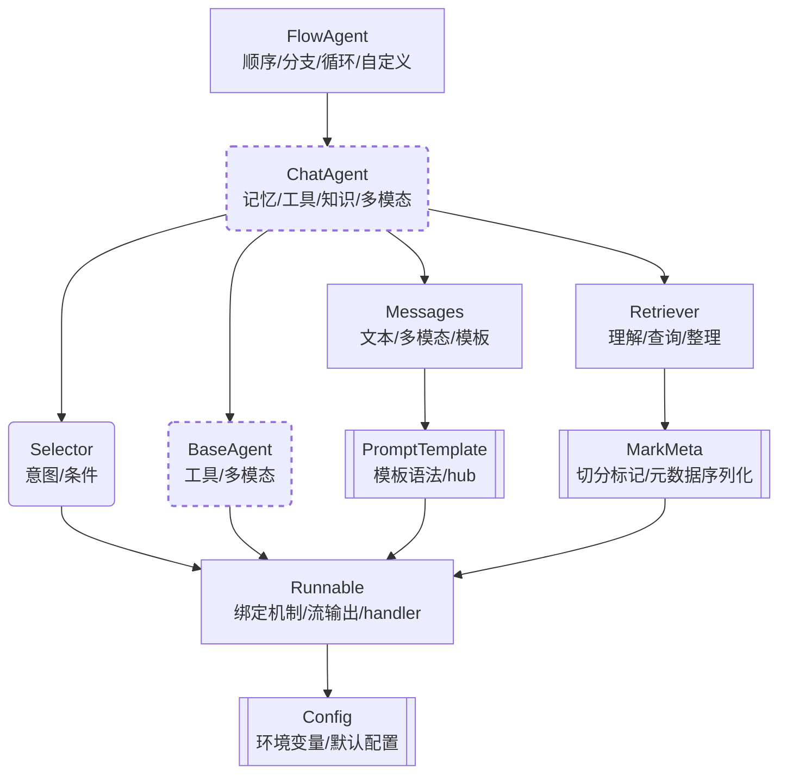

## 核心能力

**1. 基本能力**
illufly 最主要是封装了 ChatAgent 基类，在进一步封装来自千问、智谱以及 OpenAI 等大模型厂家的接口之后，可以获得 ChatQwen、ChatZhipu 以及 ChatOpenAI 等开箱即用的对话智能体子类。通过类似下面的调用，你可以直接获取多轮对话、工具回调、流输出等常用能力

```python
from illufly.chat import ChatQwen

chat = ChatQwen()
chat("你是什么模型？")
```

**2. 工具回调**
你只需要将工具作为列表传递给类的实例，即可调用工具。

```python
from illufly.chat import ChatQwen

def tool1(input: str):
    """我是一个会写诗的工具"""
    return "大海啊, 全是水"

chat = ChatQwen(tools=[tool1])
chat("你是什么模型？")
```

**3. 复杂推理**
默认情况下，你只能使用 OpenAI 风格的工具回调。但你可能还想使用其他推理模式，illufly 中已经实现:

- ReAct 一边推理一边执行
- ReWOO 一次性规划所有步骤后一起执行
- PlanAndSolve 一边修订总体计划一边执行

```python
from illufly.chat import ChatQwen, ReAct

def tool1(input: str):
    """我是一个会写诗的工具"""
    return "大海啊, 全是水"

chat = ReAct(
    planner=ChatQwen(tools=[tool1])
)
chat("你是什么模型？")
```

**3. 多智能体协作**
illufly 也允许你定义多个智能体，并让它们协作完成任务。

下面的 FlowAgent 代码中定义了一个条件循环，写手和评分专家协作完成一首儿歌的创作和评分。

```python
from illufly.chat import FlowAgent, ChatQwen, Selector

writer = ChatQwen(
    name="写手",
    memory=("system", "你是一个写手")
)

evaluator = ChatQwen(
    name="评分专家",
    memory=("system", "你是一个评分专家，根据对方写的内容评价1分-5分，仅输出评价和最终结果")
)

def should_continue():
    return "__END__" if "5" in evaluator.last_output else "写手"

flow = FlowAgent(writer, evaluator, Selector(condition=should_continue))

flow("你能帮我写一首关于兔子的四句儿歌?")
```

## 知识塔
下图不是模块的继承关系，而是知识主题的依赖关系。
也就是说，如果你要了解某个上层模块，就必须先了解下层模块。



