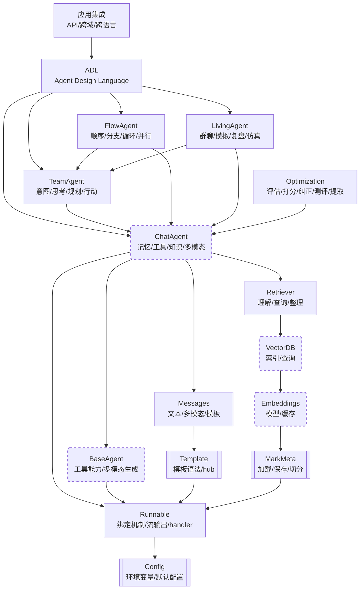
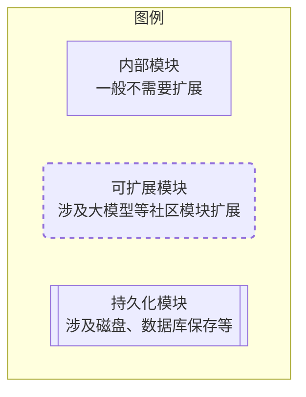

## 知识塔
下图不是模块的继承关系，而是知识主题的依赖关系。
也就是说，如果你要了解某个上层模块，就必须先了解下层模块。

```mermaid
graph TD
    Config[[Config<br>环境变量/默认配置]]
    Runnable[Runnable<br>绑定机制/流输出/handler]

    Application[应用集成<br>API/跨域/跨语言]
    ADL[ADL<br>Agent Design Language]
    Optimization[Optimization<br>评估/打分/纠正/测评/提取]
    Living[LivingAgent<br>群聊/模拟/复盘/仿真]
    Flow[FlowAgent<br>顺序/分支/循环/并行]

    Team[TeamAgent<br>意图/思考/规划/行动]
    Agent(ChatAgent<br>记忆/工具/知识/多模态)
    BaseAgent(BaseAgent<br>工具能力/多模态生成)
    Messages[Messages<br>文本/多模态/模板]
    Template[[Template<br>模板语法/hub]]

    MarkMeta[[MarkMeta<br>加载/保存/切分]]
    VectorDB(VectorDB<br>索引/查询)
    Emb(Embeddings<br>模型/缓存)
    Retriever[Retriever<br>理解/查询/整理]

    Application --> ADL
    ADL --> Agent
    ADL --> Team
    ADL --> Flow
    Flow --> Team --> Agent
    Flow --> Agent
    ADL --> Living --> Team
    Living --> Agent
    Optimization --> Agent
    Agent --> Runnable --> Config
    Agent --> BaseAgent --> Runnable
    Agent --> Messages -->  Template --> Runnable
    Agent --> Retriever --> VectorDB --> Emb --> MarkMeta --> Runnable

    style Agent stroke-width:2px,stroke-dasharray:5 5
    style BaseAgent stroke-width:2px,stroke-dasharray:5 5
    style VectorDB stroke-width:2px,stroke-dasharray:5 5
    style Emb stroke-width:2px,stroke-dasharray:5 5

```

```mermaid
graph TD
    subgraph 图例
        Inner[内部模块<br>一般不需要扩展]
        Social(可扩展模块<br>涉及大模型等社区模块扩展)
        Persist[[持久化模块<br>涉及磁盘、数据库保存等]]

        style Social stroke-width:2px,stroke-dasharray:5 5
    end
```

